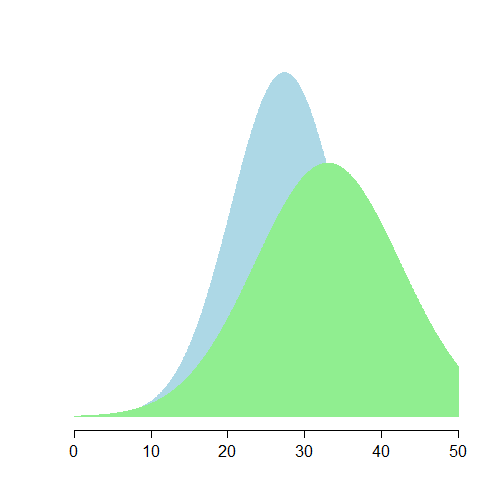
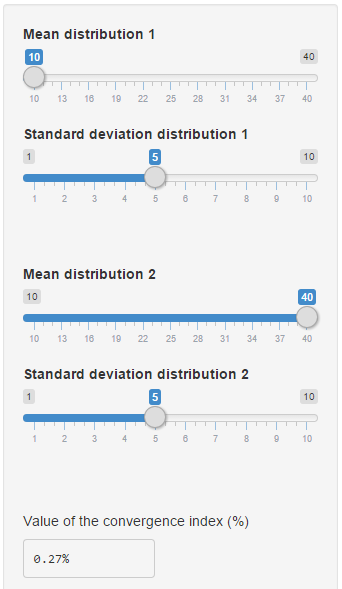
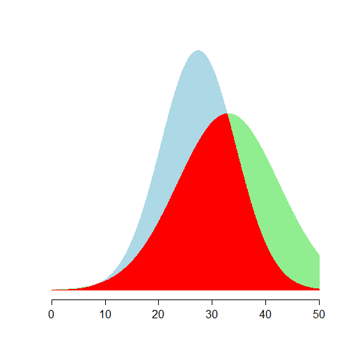

Developing Data Products: Shinny App
========================================================
author: Francisco Goerlich
date: mayo 22 2015
transition: rotate

An index of statistical convergence  
<small>
Coursera Data Science Specialization
</small>

Overview of the App
========================================================

**Purpose**: Showing visually the convergence between two distributions, and develop from this an index of convergence.

**Research Question**: Many times in economics we would like to measure how close two sets of economic data are close to each other.  
A typical example is the *convergence in per capita income*: Is the standard of living of poorer countries approaching the standard of living of richer countries?

Different people use different statistical tools to answer this question.

Standard approaches
========================================================

**$\beta$-convergence**: Some people rely on comparing descriptive measures of location between both distributions: mean, median or percentiles.

**$\sigma$-convergence**: Other people rely on comparing descriptive measures of dispersion: standard deviation, inter-quartile range or inequality indexes.

**$\delta$-convergence**: Others compare the density of the data in a more visual and less quantitative approach.  

We propose a **single index**, bounded between 0 and 1, that ilustrate the degree of convergence between both distributions. The app ilustrate visually and quantitatively this idea.

The idea is very simple...
========================================================

<small>
If we have to tell the degree of convergence between two distributions with different $\mu$ and $\sigma$, we can plot them and see if they are close or far apart.  See on the right!

But we can also calculate the overlaping area, integrate this numerically, and offer a quantitative index of convergence.

Using controls for $\mu$ and $\sigma$ of both distributions (next slide) the user can visually see how this change the value of the index...
</small>

***

 

...and the app shows you this.
========================================================

***

 
<small>
...and also how the red area changes!  
Convergence Index = 70.7%
</small>
